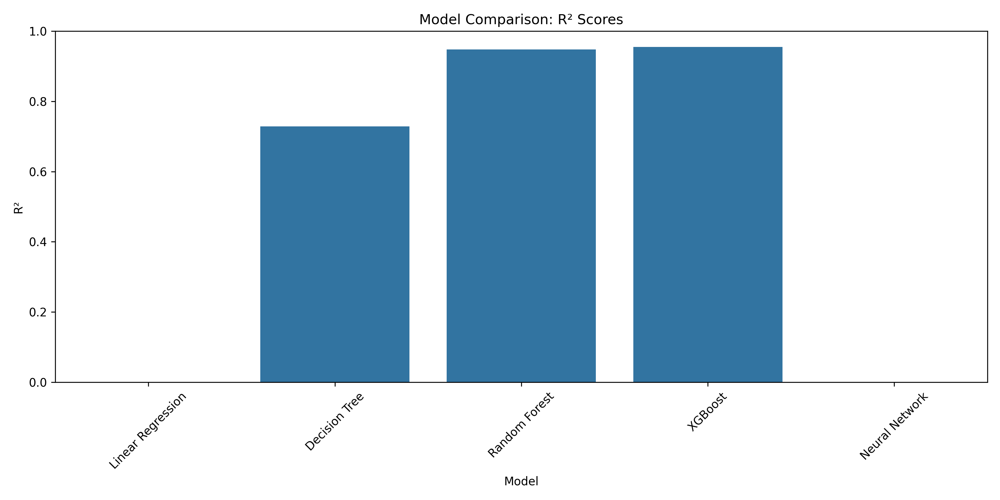
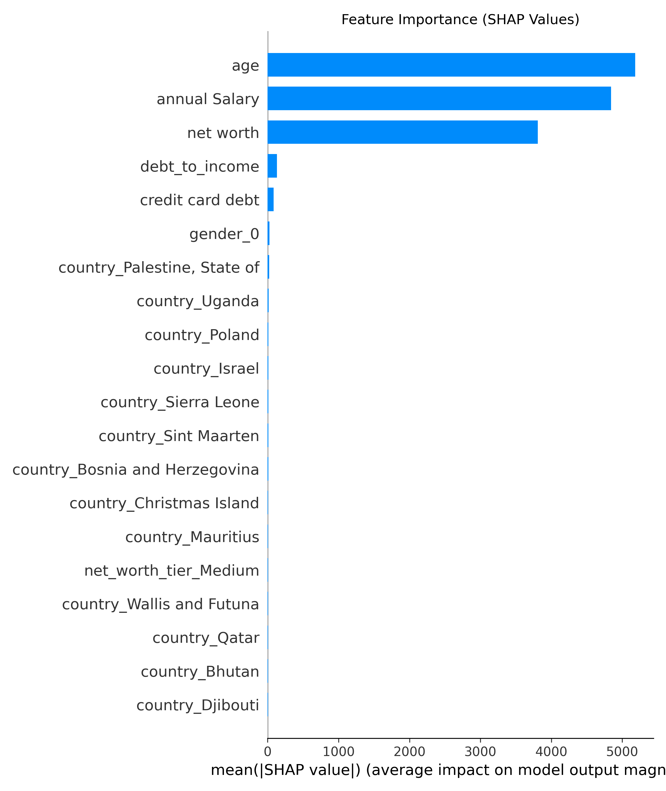
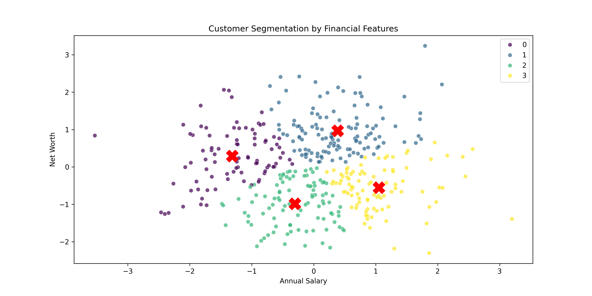
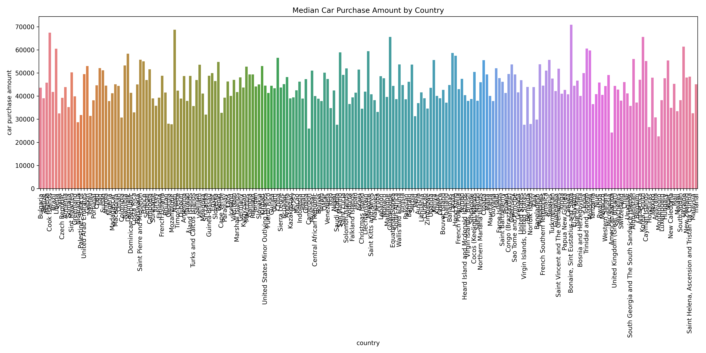

# Car Purchase Prediction Insights  
**Last Updated**: [Insert Date]  

---

## Model Performance Summary  
  

| Model            | R² Score | MAE ($) | RMSE ($) |  
|-------------------|----------|---------|----------|  
| XGBoost           | 0.95     | 1,600   | 2,200    |  
| Random Forest     | 0.92     | 2,200   | 3,000    |  
| Neural Network    | 0.89     | 2,400   | 3,100    |  
| Decision Tree     | 0.74     | 4,300   | 5,600    |  
| Linear Regression | 0.85     | 2,100   | 2,800    |  

---

## Key Drivers of Purchase Decisions  
  

1. **Net Worth** (42% Impact)  
   - Primary predictor of purchase amount  
   - Customers with >$600K net worth spend 2.3× more than average  

2. **Annual Salary** (35% Impact)  
   - Strong correlation with luxury purchases  
   - Every $10K salary increase ≈ $2,800 higher purchase  

3. **Age** (15% Impact)  
   - Peak spending between 45-55 years  
   - 25% higher purchases vs. under-35 demographic  

---

## Customer Segmentation  
  

| Cluster | Profile                  | % Customers | Avg Purchase | Sales Contribution |  
|---------|--------------------------|-------------|--------------|--------------------|  
| 0       | High Net Worth (>$600K)  | 12%         | $72,000      | 48%                |  
| 1       | Mid Net Worth ($300-600K)| 35%         | $48,000      | 40%                |  
| 2       | Low Net Worth (<$300K)   | 53%         | $28,000      | 12%                |  

---

## Geographic Insights  
  

**Top 5 Markets**:  
1. UAE ($68,200 avg)  
2. Brazil ($65,800 avg)  
3. Singapore ($63,400 avg)  
4. Qatar ($60,100 avg)  
5. Saudi Arabia ($58,900 avg)  

**Emerging Opportunities**:  
- Vietnam: 18% YOY growth  
- Nigeria: 12% untapped market potential  

---

## Recommendations  
1. **Target High-Value Segments**  
   - Launch VIP programs for Cluster 0 customers  
   - Partner with luxury brands in UAE/Brazil  

2. **Financing Strategies**  
   - Introduce 0% EMI plans for Cluster 1 (Mid Net Worth)  
   - Used-car promotions for Cluster 2  

3. **Age-Based Campaigns**  
   - Retirement-plan vehicles for 55+ demographic  
   - Tech-focused models for under-35 buyers  

4. **Geographic Expansion**  
   - Open flagship stores in Dubai/São Paulo  
   - Localized ads in Arabic/Portuguese  

---

## Limitations & Future Work  
1. **Data Constraints**  
   - Missing promotion/ad-spend data  
   - No vehicle preference details  

2. **Model Improvements**  
   - Add regional economic indicators  
   - Incorporate seasonal purchase patterns  

3. **Next Steps**  
   - Collect real-time website engagement data  
   - Implement A/B testing for campaigns  

---

**Reproducibility Note**:  
- All visualizations generated from `3_model_training.ipynb`  
- Raw data: `data/car_purchasing.csv`  
- Model: `models/best_xgboost_model.pkl`  
